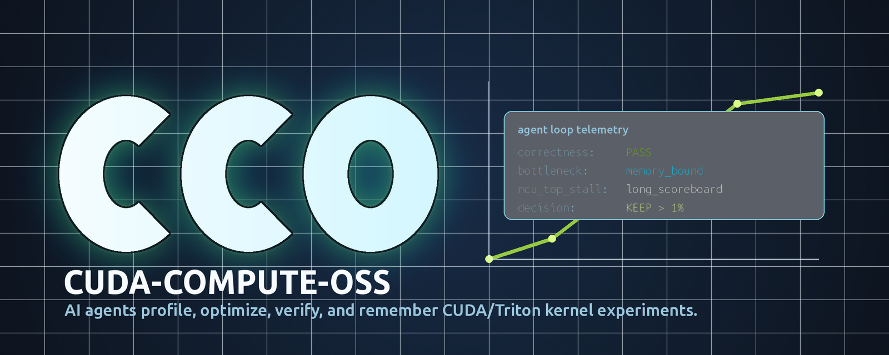

# CCO — Cuda-Compute-OSS

<p align="center">
  
</p>

<p align="center">
  <a href="https://discord.gg/kEHZ3wJuHM"></a>
  <a href="LICENSE"></a>
  <a href="https://www.python.org/downloads/"></a>
</p>

**Autonomous GPU kernel optimization driven by AI agents — verified on real datacenter hardware.**

CCO is a framework that lets AI coding agents (Claude, Codex, Cursor, etc.) iteratively profile, optimize, and validate CUDA / Triton kernels through a disciplined experimental protocol. The agent does the optimizing; this repo provides the scaffolding — the benchmark harness, the profiling tooling, the experiment lineage, and the knowledge base that grows over time.

---

## Why This Exists

Hand-tuning GPU kernels is slow, expensive, and gated by deep architecture knowledge. LLMs can read profiler output and write CUDA, but they need:

- A **structured workflow** so optimization is reproducible, not improvisational
- **Greppable metrics** so they can reason about bottlenecks without parsing prose
- **Memory across runs** so wins compound and known failures aren't re-tried
- **Real-hardware ground truth** so claimed speedups actually matter

CCO provides all four.

---

## Why This Is Specific

CCO is deliberately scoped. It does one thing — drive an AI agent through disciplined, reproducible CUDA / Triton kernel optimization on real hardware — and the rest of the design follows from that.

**Framework, not a model.** The repo provides scaffolding (protocol, harness, profiler, knowledge base). You bring the agent. Claude, Codex, Cursor, or a local model — all work. Swap them at will; nothing in the system is coupled to a particular vendor.

**Protocol-first, not search-first.** The agent doesn't blindly mutate code. It follows a 10-step experiment loop ([program.md](program.md)) — baseline, macro analysis, micro analysis, hypothesis, edit, commit, re-bench, decide, record, repeat. Every iteration is a structured experiment, not a roll of the dice.

**Persistent, growing knowledge base.** Lessons from each run land in [CUDA_OPTIMIZATION.md](CUDA_OPTIMIZATION.md), organized by kernel type *and* by bottleneck pattern (register pressure, occupancy, memory coalescing, tensor-core utilization, etc.). Wins compound. Known failure modes are recorded so they aren't re-tried. This file is the long-term artifact the project is built to grow.

**Full experiment lineage.** Every accepted change writes a row to [workspace/results.tsv](workspace/results.tsv) with the hypothesis, metrics, decision, git SHA, and parent-experiment ID. Anyone can replay the chain of optimizations that led to a given speedup.

**Greppable, machine-readable output.** Tools emit `key=value` lines, not prose. The agent reasons about `bottleneck=memory`, `occupancy=42%`, `l2_hit_rate=87%` directly — no fragile NL parsing in the middle.

**Real-hardware verification, no shortcuts.** Roofline analysis uses actual peak FLOPs and HBM bandwidth for the detected GPU. Nsight Compute supplies stall reasons, occupancy, and cache statistics from the real kernel run. Correctness is verified by a 5-stage pipeline (smoke → shape sweep → numerical stability → determinism → edge cases) against pure-PyTorch references. Numbers reported here reflect what you'd see in production.

**Multi-agent-ready.** Git worktrees isolate per-kernel work; `CUDA_VISIBLE_DEVICES` binds agents to GPUs. [tools/merge_results.py](tools/merge_results.py) consolidates `results.tsv` from parallel worktrees into the main repo.

**Small surface area.** ~10 Python files. Easy to read end-to-end, easy to fork, easy to extend.

**The core bet:** the most valuable artifact in AI-driven kernel optimization isn't the agent — it's the *accumulated knowledge of what works on what hardware for what bottleneck*. This repo is designed to grow that artifact in public.

---

## Hardware

This project is **verified on production NVIDIA datacenter and workstation GPUs**, not toy simulators. We do not lower the bar to make the demo easier — the bar is the bar.

**Tested architectures:** H100, H800, A100, L40S, L4, A10, RTX 4090, RTX 4080, RTX 3090, RTX 3080, B200, B100.

**Why this matters:**
- Roofline analysis uses real peak FLOPs and memory bandwidth, not estimates
- Nsight Compute (NCU) profiling captures actual stall reasons, occupancy, and cache behavior
- Correctness is checked against real PyTorch CUDA reference outputs, not numerical approximations
- Reported speedups reflect what you would see in production inference / training

If you don't have access to one of the tested GPUs, the framework still runs — but published benchmarks are only meaningful within a hardware class.

---

## Quick Start

```bash
# Install dependencies (uv is the supported package manager)
uv sync

# Validate environment: CUDA, Triton, NCU, GPU detection
uv run tools/prepare.py

# Pick a kernel to optimize
cp kernels/rms_norm.py kernel.py

# Baseline benchmark
uv run tools/bench.py

# Then either drive iterations manually or hand off to an AI agent:
#   "Read program.md and start optimizing kernel.py."
#
# Or run the automated loop:
uv run tools/run_loop.py --hypothesis "increase tile size from 64 to 128" --ncu
```

---

## The Optimization Loop

Defined in [program.md](program.md). Each iteration:

1. **Benchmark** `kernel.py` for throughput, bandwidth, correctness
2. **Macro analysis** — roofline classifies the kernel as compute-bound or memory-bound
3. **Micro analysis** — NCU reveals top stall reasons, occupancy, L1/L2 hit rates
4. **Hypothesize** an optimization based on the bottleneck + [CUDA_OPTIMIZATION.md](CUDA_OPTIMIZATION.md) knowledge base
5. **Modify** the kernel
6. **Commit** with the hypothesis as the message
7. **Re-benchmark**
8. **Decide** keep (>1% gain, still correct) or revert
9. **Record** to [workspace/results.tsv](workspace/results.tsv) with parent-experiment lineage
10. **Repeat**

---

## Bundled Kernels

Each kernel ships with a baseline, a reference implementation, and a benchmark config:

| Kernel | Description | Type |
|---|---|---|
| `rms_norm` | Per-row RMS normalization | Memory-bound |
| `qkv_part_rope` | QKV partial rotary positional embedding | Mixed |
| `swiglu_input_quant` | SwiGLU activation + FP8 blockwise quantization | Multi-output |
| `persistent_matmul` | GEMM with persistent CTA pattern | Compute-bound |
| `dsa_forward` | Dynamic sparse attention (GQA-aware) | Mixed |

---

## Project Structure

```
CCO/
├── program.md              # Agent workflow protocol
├── CUDA_OPTIMIZATION.md    # Agent-maintained optimization knowledge base
├── BENCHMARKS.md           # Public benchmark results
├── CONTRIBUTING.md         # How to contribute
├── kernel.py               # The kernel currently being optimized
├── kernels/                # Read-only baselines
├── kernels_optimized/      # Agent-produced optimized versions
├── kernel_configs/         # TOML + Python pairs declaring test cases
├── references/             # PyTorch reference implementations
├── memory/                 # Per-kernel experiment history
├── workspace/              # Runtime outputs (results.tsv, MEMORY.md, ncu_reports/)
├── docs/                   # Architecture and optimization references
├── tools/
│   ├── bench.py            # Benchmark harness + 5-stage correctness pipeline
│   ├── ncu_profile.py      # Nsight Compute profiling wrapper (greppable output)
│   ├── run_loop.py         # Automated experiment driver (commit → bench → decide → log)
│   ├── prepare.py          # Environment validation (CUDA, Triton, NCU, GPU detection)
│   └── merge_results.py    # Merge results.tsv from multiple agent worktrees
└── pyproject.toml
```

---

## Adding Your Own Kernel

1. Drop a baseline into `kernels/your_kernel.py` exporting `KERNEL_TYPE`, `kernel_fn`, `get_inputs`, `get_flops`, `get_bytes`.
2. Add a PyTorch reference in `references/your_kernel.py`.
3. Add a `kernel_configs/your_kernel.toml` + matching `.py` with input generators, reference fn, FLOPs/bytes callbacks.
4. `cp kernels/your_kernel.py kernel.py` and start the loop.

See [CONTRIBUTING.md](CONTRIBUTING.md) for the full checklist.

---

## Contributing

We welcome:
- New kernel baselines
- Benchmark results on new hardware
- Improvements to the agent protocol
- Documentation and reference material

See [CONTRIBUTING.md](CONTRIBUTING.md).

---

## Community

Join the CCO Discord: **[discord.gg/kEHZ3wJuHM](https://discord.gg/kEHZ3wJuHM)**

Use it to discuss kernels, share benchmark numbers across hardware, ask for help, and follow release announcements. Channels include `#help`, `#kernels`, `#benchmarks`, `#agent-prompts`, `#papers`, and `#hardware`.

---

## License

MIT
